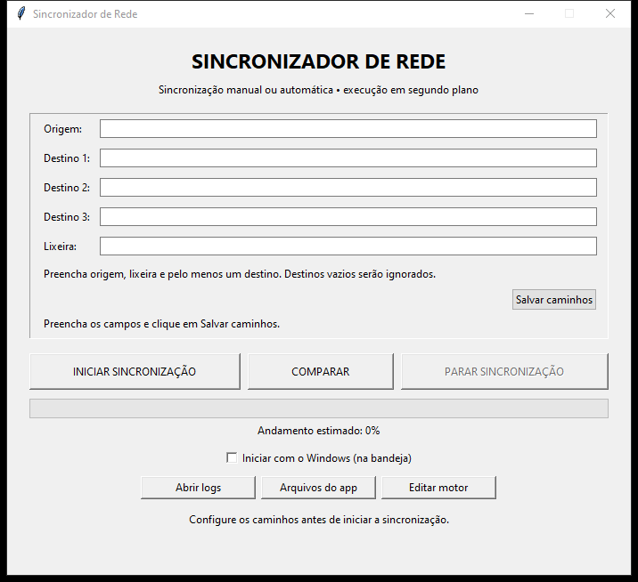
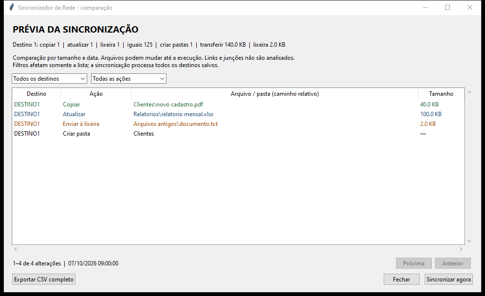
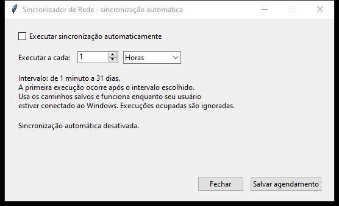

# Guia do usuário

[Voltar ao README](../README.md) · Versão 2.9.0

## 1. Instalar e atualizar

Execute `Instalar_Sincronizador_de_Rede.exe`. A instalação é feita para o usuário atual do Windows, sem necessidade de instalar Python.

Na instalação, você pode escolher iniciar o programa com o Windows e criar um atalho na área de trabalho. O aplicativo e seus dados ficam em:

```text
%LOCALAPPDATA%\SincronizadorRede
```

Para atualizar, aguarde a sincronização terminar, escolha **Sair** no menu da bandeja e execute o novo instalador. A atualização preserva `caminhos.json` e os parâmetros de retenção, simulação, tentativas e espera do BAT existente.

O motor anterior fica em `logs\sincronizador.antes-2.9.0.bat`. Um bloqueio de execução ativo impede sua atualização; nesse caso, o instalador informa que a sincronização precisa terminar antes de tentar novamente.

## 2. Configurar origem, destinos e lixeira



Preencha os campos:

- **Origem:** pasta que contém os arquivos de referência.
- **Destino 1, 2 e 3:** pastas que receberão os arquivos. Pelo menos um destino é obrigatório; destinos vazios são ignorados.
- **Lixeira:** pasta onde serão arquivados os arquivos retirados dos destinos.

Exemplo de configuração, usando caminhos fictícios:

```text
Origem:    C:\Dados\Origem
Destino 1: D:\Backups\Destino1
Destino 2: \\servidor\backup
Destino 3: deixar vazio
Lixeira:   D:\Backups\Lixeira
```

Use caminhos completos. Origem, destinos e lixeira não podem ser iguais nem ficar uns dentro dos outros. Selecione uma pasta dentro da unidade, em vez de uma unidade inteira como `D:\`.

Os caminhos preenchidos na tela não aceitam os caracteres `" % ! ^ & ( ) | < >`, devido à passagem dos argumentos pelo BAT. Espaços e acentos são aceitos. Arquivos dentro dessas pastas podem ter nomes com exclamação: a rotina de lixeira da versão 2.7 os trata literalmente.

Clique em **Salvar caminhos**. Os dados ficam em `caminhos.json` e permanecem depois que o aplicativo é fechado ou atualizado.

É possível salvar um compartilhamento de rede que esteja offline. Sua disponibilidade e suas permissões serão verificadas durante a execução. O aplicativo usa os acessos do usuário conectado ao Windows; não solicita nem armazena credenciais de rede.

Durante uma sincronização ou comparação iniciada pelo aplicativo, os campos ficam desabilitados. Fora dessas operações, alterações na tela só passam a valer depois de salvas. A execução automática usa sempre o arquivo salvo, mesmo que existam alterações ainda não gravadas na janela.

## 3. Comparar antes de sincronizar

Salve os caminhos e clique em **Comparar**, ou use **Comparar pastas** no menu da bandeja. A análise é somente leitura: não copia, move ou exclui arquivos, nem cria os destinos ou a lixeira.



O resumo mostra as quantidades por destino, os arquivos iguais e os tamanhos previstos de transferência e arquivamento. A lista mostra as alterações:

- **Copiar:** arquivo presente na origem e ausente no destino.
- **Atualizar:** arquivo existente nos dois lados, com tamanho ou data de modificação diferentes.
- **Enviar à lixeira:** arquivo presente no destino e ausente na origem.
- **Criar pasta:** pasta da origem ainda inexistente no destino, incluindo pastas vazias.

Use os filtros por destino e ação para consultar a lista. Ela mostra até 250 alterações por página; use **Anterior** e **Próxima**. **Exportar CSV completo** inclui todas as alterações, independentemente dos filtros e da página atual.

**Sincronizar agora** processa todos os destinos salvos. Os filtros afetam apenas a visualização. Se os caminhos ou o motor mudarem depois da análise, o aplicativo exige nova comparação.

A prévia considera tamanho e data, sem verificar conteúdo por hash. Links e junções não são analisados. Os arquivos podem mudar depois da análise; o motor os verifica novamente na execução. Falhas de acesso ou conflitos entre arquivo e pasta impedem apresentar uma prévia completa.

Durante a análise, use **Parar comparação** na janela para cancelar. O disparo automático é ignorado enquanto o aplicativo estiver ocupado. A execução agendada continua iniciando diretamente, sem abrir uma prévia.

## 4. Executar e acompanhar

Clique em **Iniciar sincronização**. O aplicativo primeiro examina a origem e depois processa os destinos em sequência. A análise inicial pode demorar em pastas grandes.

A primeira cópia envia os arquivos e subpastas, incluindo pastas vazias. Nas próximas execuções, arquivos iguais são ignorados e arquivos novos ou diferentes são copiados. A pasta de destino é criada quando possível; um compartilhamento inexistente, uma unidade desconectada ou falta de permissão continuam sendo erros de acesso.

O andamento é estimado. A janela mostra a barra de progresso e o ícone da bandeja mostra a porcentagem. Confira os logs para conhecer os resultados por destino.

Uma execução concluída com sucesso mostra 100% e reproduz o som de conclusão do Windows. Erros produzem um aviso e ficam registrados nos logs.

Clique em **Parar sincronização** para interromper o motor e seus processos filhos. Os arquivos já copiados ou arquivados não são desfeitos. Depois da parada, uma nova execução volta a comparar a origem com os destinos.

## 5. Usar a bandeja do Windows

Depois da configuração inicial, o aplicativo pode permanecer na bandeja. O ícone também pode estar no grupo de ícones ocultos do Windows.

- **Abrir:** mostra a janela principal; o duplo clique no ícone também a abre.
- **Comparar pastas:** mostra a prévia de alterações sem modificar os arquivos.
- **Iniciar sincronização:** inicia uma execução manual.
- **Parar sincronização:** interrompe a execução em andamento.
- **Sincronização automática...:** configura a tarefa do Windows.
- **Abrir logs:** abre a pasta de registros.
- **Sair:** encerra o aplicativo quando não há sincronização em andamento.

Fechar a janela pelo **X** mantém o aplicativo na bandeja quando ela estiver disponível. Para encerrar, use **Sair**.

## 6. Configurar a execução automática



1. Salve a origem, a lixeira e pelo menos um destino.
2. Clique com o botão direito no ícone da bandeja.
3. Escolha **Sincronização automática...**.
4. Marque **Executar sincronização automaticamente**.
5. Informe um número inteiro e escolha **Minutos**, **Horas** ou **Dias**.
6. Clique em **Salvar agendamento** e confira o estado mostrado na tela.

O intervalo permitido vai de 1 minuto a 31 dias. A primeira execução ocorre após esse intervalo. Se o aplicativo estiver fechado, o disparo o abre na bandeja; se já estiver aberto, a solicitação chega à mesma instância.

A tarefa pertence ao usuário atual e usa uma sessão interativa, sem guardar senha. As execuções dependem de esse usuário estar conectado ao Windows. [Contextos de segurança do Agendador](https://learn.microsoft.com/en-us/windows/win32/taskschd/security-contexts-for-running-tasks).

Um disparo durante outra sincronização é ignorado e registrado no log. Ele não cria uma fila de execuções pendentes.

Para desativar, desmarque a opção e clique em **Salvar agendamento**. Isso não interrompe uma sincronização já iniciada; use **Parar sincronização** para interrompê-la.

Sair do programa não desativa a tarefa. A desinstalação tenta remover a tarefa pertencente ao usuário que executa a desinstalação.

## 7. Entender a lixeira

Se um arquivo estiver no destino e não existir mais na origem, o programa tenta movê-lo para a lixeira antes de copiar os arquivos desse destino.

Na versão 2.9, os novos arquivos apagados ficam diretamente na pasta escolhida:

```text
Lixeira escolhida\
  arquivo.txt
  documento.pdf
  arquivo (apagado data DESTINO2-identificador).txt
```

O nome original é mantido quando estiver disponível. Se arquivos de subpastas ou destinos diferentes tiverem o mesmo nome, os seguintes recebem um sufixo com data, destino e identificador; nenhum arquivo da lixeira é sobrescrito.

Para restaurar, copie o arquivo para a pasta apropriada. Consulte o log de sincronização para encontrar o caminho anterior: as entradas `[LIXEIRA]` mostram o caminho no destino e o nome na lixeira. Se deseja mantê-lo em futuras sincronizações, restaure-o também na origem.

O prazo padrão é de cinco dias desde o arquivamento, independentemente da idade do arquivo. O histórico fica em `%LOCALAPPDATA%\SincronizadorRede\lixeira.sqlite3`, junto dos dados do aplicativo, sem criar arquivos de controle na lixeira. A limpeza ocorre durante uma sincronização; um arquivo vencido pode permanecer até a próxima execução.

A limpeza verifica a identidade, o tamanho e a data do arquivo contra o registro, sem comparação por hash de conteúdo. Arquivos colocados manualmente na lixeira e arquivos arquivados com esses dados alterados são preservados. Mantenha o índice ao fazer backup dos dados do aplicativo; se ele estiver ausente, os arquivos sem registro não serão apagados automaticamente.

As pastas de lotes das versões 2.7/2.8 não são reorganizadas pela atualização. Os lotes identificados continuam sujeitos ao prazo anterior; arquivos da lixeira antiga sem data confiável de exclusão são preservados. Novos arquivamentos usam apenas a pasta principal.

Durante a transferência entre unidades pode aparecer um arquivo temporário `.sincronizador-*.tmp`, removido ao terminar a operação.

Uma falha ao arquivar um arquivo é registrada como erro, e a cópia para aquele destino é suspensa. Somente movimentações concluídas entram no contador.

Arquivos existentes apenas nos destinos também são considerados ausentes na origem e seguem essa regra. Arquivos substituídos por uma versão diferente da origem não recebem uma cópia da versão anterior na lixeira.

## 8. Logs e configurações

Use **Abrir logs** para abrir `%LOCALAPPDATA%\SincronizadorRede\logs`.

- `aplicativo.log`: eventos da interface, salvamento dos caminhos, início e encerramento das execuções e erros.
- `Sincronizacao_*.log`: detalhes por destino, movimentações para a lixeira, código do Robocopy e resumo final.
- `Execucao_*.log`: saída capturada da execução do motor.
- `sincronizador.antes-2.9.0.bat`: cópia do motor anterior à atualização atual. Backups de versões anteriores também podem estar presentes.

O histórico da lixeira está em `lixeira.sqlite3`, na pasta de dados do aplicativo. Ele registra nomes, destino, caminho original e data, e permite retomar registros de movimentações interrompidas. Uma falha ao gravar o índice é informada como erro.

O botão **Arquivos do app** abre a pasta de dados. **Editar motor** abre o BAT no editor, quando não há execução em andamento. Os ajustes de retenção, simulação, tentativas e espera usados pelo motor estão nesse BAT; editar apenas `config.ini` não muda essas opções de execução.

## 9. Solução de problemas

**Origem ou destino inacessível:** abra o caminho no Explorador de Arquivos usando o mesmo usuário. Confira conexão, nome do compartilhamento e permissões. Uma pasta válida pode ser salva mesmo offline, mas isso não comprova acesso para copiar.

**WinError 3 em arquivo com caminho longo:** atualize para a versão 2.7.1 ou posterior. O programa usa o formato estendido do Windows para examinar arquivos e operar a lixeira, sem precisar alterar o caminho salvo. Se o erro persistir, confira se o arquivo ainda existe e consulte o caminho completo no log.

**Aviso de erro abreviado na bandeja:** mensagens longas são resumidas para respeitar o limite do Windows. A janela de erro e os logs mantêm o texto completo.

**Comparação não concluída:** verifique o acesso às pastas e se algum arquivo foi removido durante a leitura. Em conflitos entre arquivo e pasta, corrija o item indicado antes de comparar novamente.

**Não é possível salvar:** confirme que a própria janela não está sincronizando e que os caminhos atendem às regras. Preencha a lixeira e pelo menos um destino; confira se nenhuma pasta contém outra.

**Execução anterior ou bloqueio:** consulte os logs e confirme se existe uma sincronização em andamento antes de iniciar novamente. O arquivo de bloqueio impede execuções concorrentes; não o remova enquanto uma operação estiver ativa.

**Erro na lixeira:** confira espaço disponível e permissão de criação e movimentação na pasta escolhida. Consulte as entradas `[ERRO_LIXEIRA]`, `[ERRO_ARCHIVE]` ou `[ERRO_CLEANUP]` no log.

**Erro no agendamento:** confira o funcionamento do Agendador de Tarefas do Windows e a permissão para criar tarefas para o usuário atual. A tela só mostra o estado ativo depois da confirmação pelo Windows.

**Arquivo alterado não foi atualizado:** a comparação usa tamanho e data, sem hash. A tolerância `/FFT` foi removida na versão 2.7, mas uma alteração que preserve tamanho e data de modificação pode continuar sendo considerada igual. [Opções de comparação do Robocopy](https://learn.microsoft.com/pt-br/windows-server/administration/windows-commands/robocopy).
